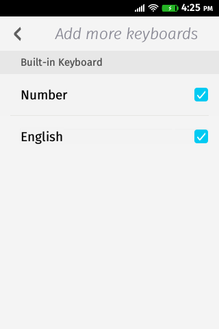
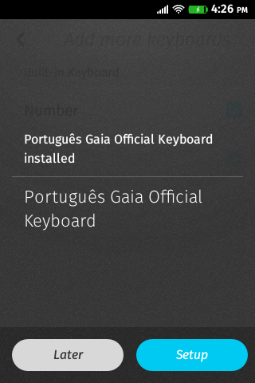
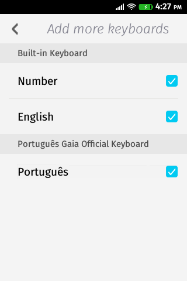

Script to create 3rd party keyboards for every language supported by Firefox OS
native keyboard.

## Requirements

- Python3
- Clone of [Gaia](https://github.com/mozilla-b2g/gaia)

## How to use

- Clone this project

    $ https://github.com/r-gaia-cs/build-3rd-party-keyboard.git

- Add it to your `PATH`

    $ cd build-3rd-party-keyboard
    $ export PATH=$PATH:$(pwd)

- Move to the root of your Gaia clone

    $ cd /path/to/your/gaia

- Run the script

    $ build-3rd-party-keyboard.py -l lang

  where `lang` is the language that you want to build.

The keyboard was create at `/path/to/your/gaia/build_stage/lang-keyboard`. You
can zip it and send to [Firefox Marketplace](http://marketplace.firefox.com/).

## Install 3rd party keyboard at device

Install the 3rd party keyboard from Firefox Marketplace or use [App
Manager](https://developer.mozilla.org/en-US/docs/Mozilla/Firefox_OS/Using_the_App_Manager)
and follow the instructions.

## Related works

- [Bug 1029539](https://bugzilla.mozilla.org/show_bug.cgi?id=1029539)
